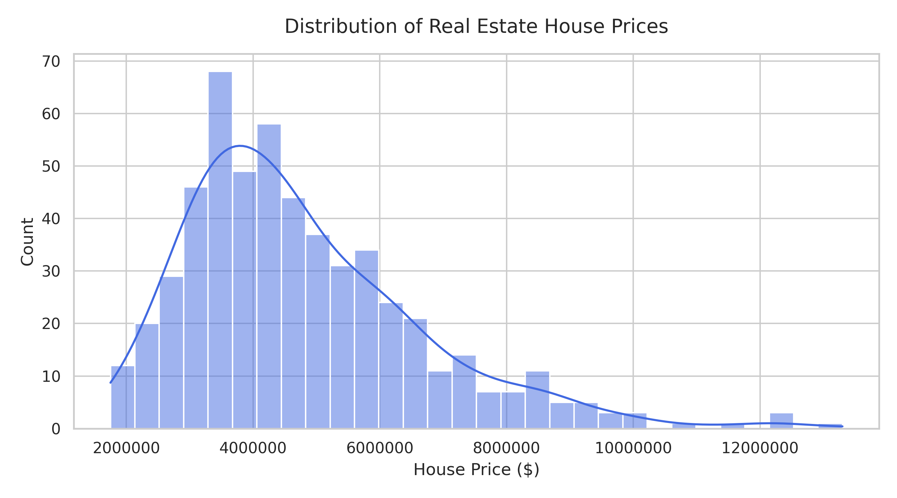
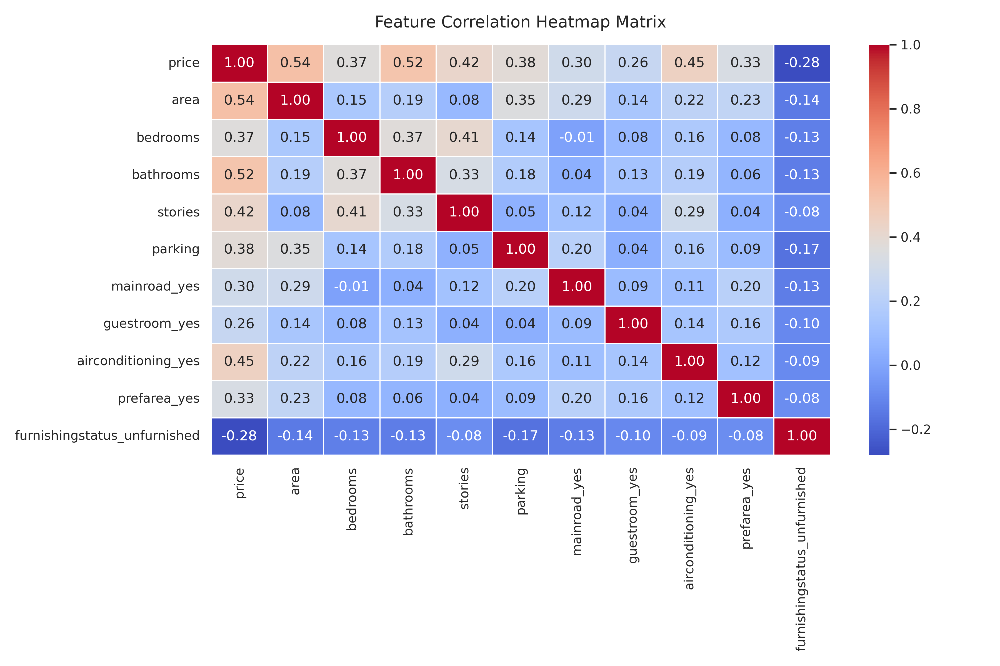
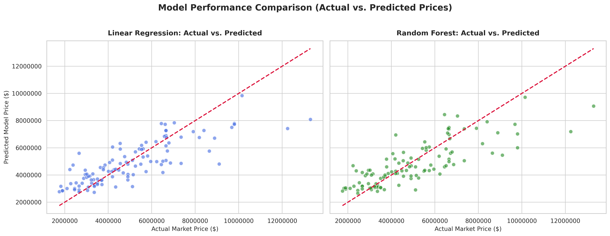

# 🏠 House Price Prediction

[]()
[]()
[]()
[]()

## 📌 Project Overview

This project was completed as part of the **Week 1 Internship Assignment**.

The goal of this project is to build a machine learning model capable of predicting house prices based on various property features such as area, number of bedrooms, bathrooms, parking spaces, furnishing status, and additional amenities.

Using a real-world housing dataset, the project covers the complete machine learning workflow:

- Data Loading & Exploration
- Data Cleaning & Preprocessing
- Feature Selection
- Model Training
- Model Evaluation
- Data Visualization
- Business Insights & Recommendations

---

## 🎯 Problem Statement

Estimating the fair value of a property is a challenging task for both buyers and sellers.

This project aims to develop predictive models that can estimate house prices using property characteristics while identifying the features that most strongly influence market value.

---

## 📂 Dataset

**Dataset Source:**

Housing Prices Dataset by Yasser H.

🔗 https://www.kaggle.com/datasets/yasserh/housing-prices-dataset

The dataset contains various housing attributes including:

- Area
- Bedrooms
- Bathrooms
- Stories
- Parking
- Main Road Access
- Guest Room Availability
- Basement Availability
- Hot Water Heating
- Air Conditioning
- Furnishing Status

and other property-related features.

---

## 🛠️ Technologies Used

| Technology | Purpose |
|------------|----------|
| Python | Programming Language |
| Pandas | Data Manipulation |
| NumPy | Numerical Computation |
| Scikit-Learn | Machine Learning Models |
| Matplotlib | Visualization |
| Seaborn | Statistical Visualization |
| Google Colab | Development Environment |

---

## 🔍 Project Workflow

### 1. Data Loading & Exploration

- Loaded dataset using Pandas
- Displayed initial records
- Checked dataset dimensions
- Identified target and feature variables
- Verified missing values

### 2. Data Cleaning

- Removed duplicate records
- Handled missing values
- Applied One-Hot Encoding to categorical features
- Selected meaningful features based on correlation with house price

### 3. Model Building

Two regression models were trained:

#### Linear Regression

A simple and interpretable baseline model used for predicting house prices.

#### Random Forest Regressor

An ensemble learning technique that combines multiple decision trees for improved predictive performance.

Dataset split:

- Training Set: 80%
- Testing Set: 20%

---

## 📊 Model Performance

| Model | MAE | RMSE | R² Score |
|---------|---------:|---------:|---------:|
| Linear Regression | $964,971.86 | $1,339,904.16 | **0.6448** |
| Random Forest Regressor | $1,007,505.10 | $1,372,854.17 | 0.6271 |

### Best Performing Model

🏆 **Linear Regression**

The Linear Regression model achieved the highest R² Score of **64.48%**, outperforming the Random Forest Regressor on this dataset.

---

## 📈 Visualizations

### Chart 1 – House Price Distribution

Shows the distribution of house prices across the dataset.



---

### Chart 2 – Correlation Heatmap

Illustrates relationships between features and helps identify variables strongly associated with house price.



---

### Chart 3 – Actual vs Predicted Prices

Compares model predictions with actual house prices to visually evaluate prediction accuracy.



---

## 🔑 Key Findings

- Property **area** is one of the strongest predictors of house price.
- Houses with more **bathrooms** generally command higher market values.
- **Air conditioning availability** has a noticeable positive influence on pricing.
- The relationship between the selected features and house prices appears largely linear.
- Linear Regression performed slightly better than Random Forest for this dataset.

---

## 💡 Business Recommendation

Based on the analysis, real estate businesses and investors should prioritize properties that offer:

- Larger living areas
- Multiple bathrooms
- Modern amenities such as air conditioning

These features consistently contribute to higher property valuations and stronger market demand.

---

## 📁 Repository Structure

```text
House-Price-Prediction/
│
├── House_Price_Prediction_Gulshan_Kumar.ipynb
├── Housing.csv
├── summary.pdf
├── README.md
│
└── charts/
    ├── chart1_price_distribution.png
    ├── chart2_correlation_heatmap.png
    └── chart3_actual_vs_predicted.png
```

---

## 👨‍💻 Author

**Gulshan Kumar**

B.Tech Electrical Engineering  
National Institute of Technology, Jalandhar

GitHub: https://github.com/Gulshan-heap

---

## 📜 License

This project was developed for educational and internship learning purposes.
